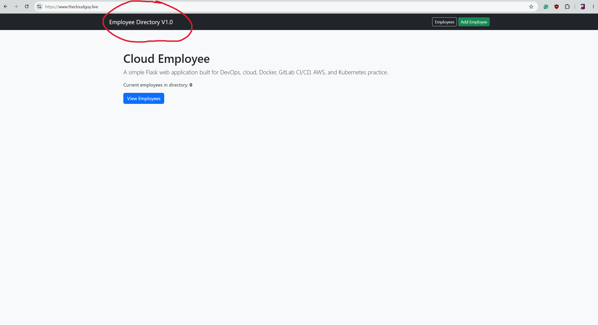
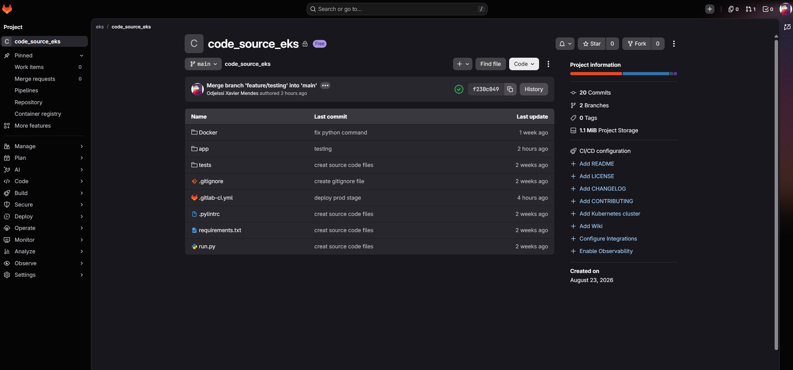
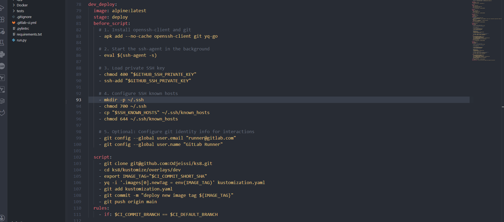
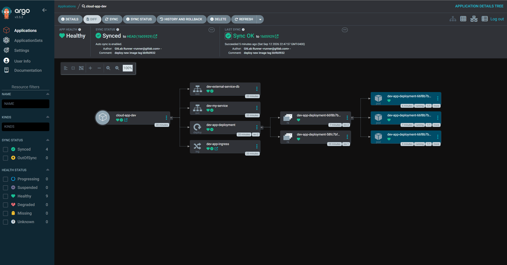
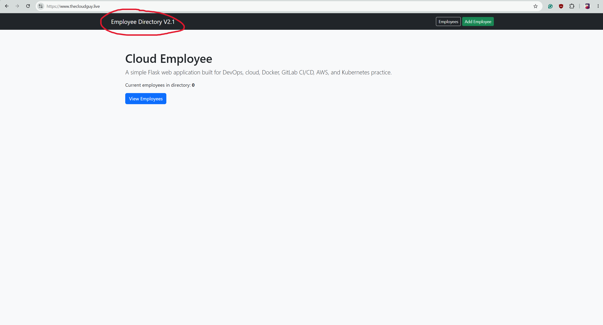

# AWS EKS GitOps Project

This project shows a full CI/CD and GitOps deployment flow using **GitLab CI/CD, Docker, Amazon ECR, Terraform, Kubernetes, Argo CD, Kustomize, ExternalDNS, and AWS EKS**.

The project is split into 3 repositories:

- [code_source_eks](https://github.com/Odjeissi/code_source_eks) — application code and CI pipeline
- [iac-eks](https://github.com/Odjeissi/iac-eks) — AWS infrastructure with Terraform
- [ks8](https://github.com/Odjeissi/ks8) — Kubernetes manifests and GitOps configuration

## How It Works

```text
Developer pushes code
        |
        v
GitLab CI/CD
        |
        v
Run tests
        |
        v
Build Docker image
        |
        v
Push image to Amazon ECR
        |
        v
Update image tag in ks8 repo
        |
        v
Argo CD detects the change
        |
        v
Deploy new version to Amazon EKS
```

The CI pipeline does not deploy directly to Kubernetes.

Instead, it updates the image tag inside the `ks8` repository. Argo CD watches this repository and syncs the new version to the EKS cluster.

## Repository Structure

```text
ks8/
├── argocd/
├── kustomize/
├── ExternalDNS/
├── eso/
├── policies/
└── .gitignore
```

### Main Parts

**Kustomize**  
Used to manage Kubernetes manifests and the development environment.

**Argo CD**  
Watches this GitHub repository and automatically syncs changes to EKS.

**ExternalDNS**  
Manages DNS records in AWS Route 53 from Kubernetes.

**External Secrets Operator**  
Used to manage application secrets without storing sensitive values directly in Git.

**Policies**  
Contains Kubernetes security and policy configuration.

## CI/CD Flow

The application pipeline runs these steps:

```text
Test
  |
  v
Build Docker Image
  |
  v
Push to ECR
  |
  v
Update Kustomize Image Tag
  |
  v
Push change to GitHub
```

The Docker image uses the Git commit SHA as the tag.

Example:

```text
f230c049
```

The deploy job updates the image tag in the Kustomize configuration:

```yaml
images:
  - name: <ECR_IMAGE>
    newTag: f230c049
```

Then Argo CD sees the Git change and deploys the new image to EKS.

## Testing the Full Deployment Flow

To test the full CI/CD and GitOps flow, I made a simple change to the application navbar.

Before:

```text
Employee Directory V1.0
```

After:

```text
Employee Directory V2.1
```

This small change helped confirm the full process from application code to the running Kubernetes application.

```text
Change application code
        |
        v
Push to GitLab
        |
        v
Pipeline runs
        |
        v
New Docker image pushed to ECR
        |
        v
ks8 image tag updated
        |
        v
Argo CD syncs
        |
        v
New version appears in the browser
```

## Screenshots

### Application Before Deployment



### GitLab CI/CD



### CI/CD Updating the GitOps Repository



### GitOps Repository


### Argo CD Sync



### Application After Deployment



## Tools Used

- AWS EKS
- Amazon ECR
- Terraform
- Kubernetes
- Docker
- GitLab CI/CD
- Argo CD
- Kustomize
- ExternalDNS
- External Secrets Operator
- GitHub
- Python / Flask

## What I Learned

This project helped me understand how a CI/CD and GitOps workflow works from start to finish.

I practiced:

- building and pushing Docker images
- using GitLab CI/CD
- deploying applications to EKS
- using Terraform for AWS infrastructure
- using Argo CD for GitOps
- using Kustomize to manage Kubernetes deployments
- updating image versions automatically
- separating application, infrastructure, and Kubernetes configuration into different repositories
